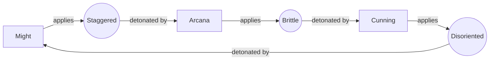
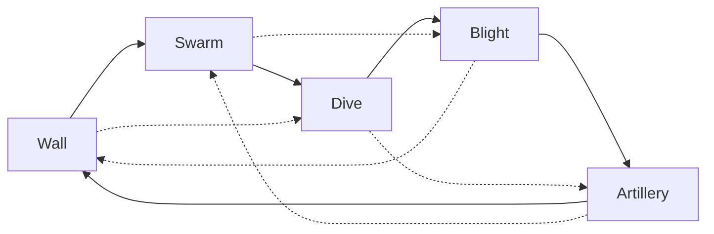

# Heroes, combos and builds (brainstorm)

Status: brainstorm, 2026-09-22. The decisions in §11 are settled; everything
else is still draft. Nothing here is built. It follows up on the "Roster,
items and combos: a design doc first" note in
`docs/board-and-renderer-plan.md`, stage 5. §12 parks the Jev
personality idea, and §13 is a short check against the 8 kinds of fun.

The goal: runs that play out differently each time, builds that can get
properly broken, and battles where the big moments come from heroes
working together, not from bigger numbers.

## 0 The constraint that decides everything: the pick budget

Today a seat has 3 run-health, the round cap is 8 and there is one upgrade
pick after each non-final round. That's at most 7 picks, and fewer for most
seats, because with 3 health half the lobby is out by round 5 or 6.
Talents, runes, items across 3 to 5 heroes and two recruits don't fit in 7
picks. Anything that shows up "late" would only ever be seen by the last
two or three survivors.

So the round track comes first, and slot counts, socket counts and rarity
bands are worked out from it.

**Decided (numbers still to be tuned with probes):** run health goes up to 12. A lost duel
costs `1 + surviving enemy heroes`, capped at 4, so a blowout hurts more
than a close loss. A draw costs 0, and the cap rises to 15.

The arithmetic: a close loss costs about 2 to 3, so a seat that wins half
its duels goes out around rounds 9 to 10, and the eventual winner plays
13 or 14 rounds. Everything headline in the track below (capstones,
legendaries) therefore lands by round 7, so a 50% seat still gets two or
three rounds with it. Tune this with headless full-run probes before
trusting it.

## 1 The round track

Every surviving seat gets **one item pick every round**, plus a
**milestone pick** on a fixed schedule that everyone can see. The HUD shows
the track, so you can plan ahead: "legendary items land after round 7, so
I'll build towards that".

| After round | Every round | Milestone |
| --- | --- | --- |
| draft | — | pick 3 of 5 heroes (as today) |
| 1 | item (common) | rune |
| 2 | item (common) | **talents tier 1**, every hero |
| 3 | item (common) | **recruit or train** (4th hero) |
| 4 | item (rare) | rune |
| 5 | item (rare) | **talents tier 2**, every hero; opens rune socket 2 |
| 6 | item (rare) | **recruit or train** (5th hero) |
| 7 | item (legendary) | **talents tier 3** capstones |
| 8 | item (legendary) | rune |
| 9+ | item (legendary) | rune on even rounds |

- **Pick 1 of 3.** Every offer is three options drawn from the seat's own
  seeded stream. Today's upgrade phase lists *every* eligible upgrade, so
  this needs sampling.
- **Loser's consolation:** the loser of a duel sees 4 item options instead
  of 3. It's a small catch-up that adds no new system.
- **Surprise rolls:** from round 3, each item offer has a ~5% chance to
  contain one item a rarity above the band.
- **Talent rounds level every hero at once.** Each hero picks left or
  right at that tier (see §4), so no hero gets left behind. With 5 heroes
  that's 5 quick binary choices.
- **Recruit or train.** Take 1 of 3 new heroes, or decline and give one
  existing hero a 3rd rune socket. Going wide or going tall is a real
  choice. A recruited hero arrives at the current talent tier and you pick
  its talents on arrival.
- **Runes are scarce on purpose.** That's 4 runes by round 10 across up
  to 10 sockets, so where you put them is where your broken carry comes
  from.
- **Decision load:** the prep window is 15 s today, and placement already
  happens inside it. This needs about 30 s on normal rounds and 45 s on
  milestone rounds, or a separate reward phase before placement.
- **Run duration:** a round is roughly 30 to 45 s of prep, 12 to 20 s of
  battle playback (a 25 to 40 s fight at 2×, see §14) and a 3 s pause.
  That's about 45 to 70 s a round, so a winner's 13 or 14 rounds take
  about 14 minutes and a seat knocked out around round 9 plays about 9.
  That's short enough for "one more run".

## 2 Schools and combos (the Dragon Age 2 layer)

Every hero has a **school**, which is the type of its hits: **Might**
(heavy physical), **Arcana** (spells) or **Cunning** (precision, poison,
tricks). There are three **conditions**, and each school is the one that
detonates the previous school's condition:

| Condition | Usually applied by | Detonated by | Combo |
| --- | --- | --- | --- |
| Staggered | Might heavy hits | an Arcana hit | **Overload**: +100% of that hit's damage and a 1 s knockdown |
| Brittle | Arcana frost | a Cunning hit | **Shatter**: crits for ×2.5, shards deal 30% to enemies within 1 cell |
| Disoriented | Cunning poison and tricks | a Might hit | **Crush**: +100% damage and the target loses 50% of its mana |

**Rules (keep them this simple):**

1. A target holds **one condition at a time**. A new one replaces the old,
   so allies can overwrite each other and the order of hits matters.
2. A condition lasts 3 s.
3. A detonation **consumes** the condition.
4. A hero **can't detonate a condition it applied itself**. Breaking this
   rule is what hybrid talents, the Resonance rune and some legendaries
   are for.
5. **DoT ticks, detonation damage and triggered casts never apply or
   detonate conditions.** Every combo, echo and trigger rune goes through
   the existing bounded reaction queue (Phase 4's depth and budget). A
   triggered cast can't fire more trigger runes. The broken builds should
   be broken on purpose, not infinite loops.

**Attunement** (the "synergy tags with thresholds" from the board plan): 3 heroes of one school give a team bonus. Might 3: +20% max HP.
Arcana 3: +25% mana gain. Cunning 3: +20% crit chance. It's the
counterweight to "one of each school gets every combo". At 3 heroes you
choose between a bonus and combos. At 5 you can mix 3+2 and get a bonus
plus some combos.

### Combo traits and icons

This works like Underlords alliances: every hero wears small icons, and
owning the right mix lights a trait. Here **the combo pairs are the
traits**. A combo can only ever fire if your team has both halves, so the
trait strip shows exactly that.

**Icon set: six icons, nothing else.**

| Icon | Shape | Colour |
| --- | --- | --- |
| Staggered | zigzag crack | orange-amber `#ffa928` |
| Brittle | six-spoke shard | pale ice `#9fe8ff` |
| Disoriented | spiral | violet `#b58cff` |
| Might | hammer | neutral |
| Arcana | four-point star | neutral |
| Cunning | dagger | neutral |

- Colours belong to the conditions only. Every colour is paired with a
  distinct shape, so it all reads without colour (Phase 9 asks for that).
- Why these hex values: Brittle has to stay clear of your-side blue
  `#4ea1ff` and the shield cue `#60a5fa`, so it's a pale ice rather than a
  true blue. Staggered is an orange-leaning amber so it doesn't drift
  into the "you" gold `#e2bd5c`. That puts it next to today's orange
  damage cue `#ffb454`, which is why §15 proposes making normal damage
  white.
- A combo has no icon of its own. Shatter is the Brittle icon bursting,
  Overload is the Staggered icon bursting, and so on.
- A hero shows two things: its school icon and an "applies" chip (the
  condition icon in its colour). What it detonates follows from its
  school, so the trait strip and the hover card say it and the hero plate
  doesn't.

**Combo traits (the trait strip):**

| Trait | Lights at | Tier II (2 appliers + 2 detonators) |
| --- | --- | --- |
| Overload | a Staggered applier + a different Arcana hero | knockdown 1.5 s, and the bonus also hits adjacent enemies at 50% |
| Shatter | a Brittle applier + a different Cunning hero | Brittle lasts 5 s, shards deal 60% |
| Crush | a Disoriented applier + a different Might hero | the target loses all its mana and is slowed for 2 s |

- Each row shows applier pips and detonator pips, like
  `[Brittle] ●○ → [Cunning] ●○`.
- A lit combo gives **no separate stat bonus**. The combo firing at all is
  the reward. A bonus on top would reward "one of each school" twice and
  undercut Attunement.
- Attunement (3 heroes of one school) is the second kind of row in the
  same strip.

**Counting rules**, so the strip never says something the battle won't do:

1. **Unique heroes.** Hero offers can repeat today, and five Frostweavers
   mustn't reach Shatter tier II on their own.
2. **The two halves must be different heroes** (combo rule 4). A Bulwark
   carrying Thunder Maul applies Staggered *and* detonates as Arcana, but
   can't light Overload alone. The Resonance rune and hybrid talents are
   the stated exceptions, and the strip shows those as a self-combo
   marker.
3. **Items and runes count.** Frost Brand, Pocket Sand and the Primer
   runes add "applies" chips, and Thunder Maul adds a detonator. That's
   what makes moving items between rounds a trait decision.
4. **Attunement counts printed schools only.** Thunder Maul makes a hero
   an Arcana detonator in the combo rows, but it doesn't add to Arcana
   Attunement.

**Where the icons show up:**

- **Hero plates** on the board during prep: school icon plus the applies
  chip.
- **Offer cards** (draft, recruit, items, runes): a highlight when the
  pick would light or upgrade a row, like "+ Shatter" or "Shatter
  I → II".
- **The trait strip**, with a live preview while you drag an item or rune
  ("dropping Frost Brand here lights Shatter II"). Hovering a row
  highlights the heroes behind it on the board.
- **In battle**: a held condition shows as its icon above the target's
  health bar, with a ring counting down its 3 s. On detonation the icon
  bursts and the combo name pops.
- **After the battle**: combo counts per trait feed a "moment of the
  match" callout.

**Role and archetype traits** (the "two healers → healing amplification"
idea) are held back for now. Each archetype has exactly two fixed heroes,
so a threshold-2 archetype trait is really a bonus for drafting one
specific pair. It would narrow drafts and add a third icon row to every
hero, and there's only one healer in the roster. Revisit this once
next-wave heroes give archetypes three or more members.

## 3 The counter wheel

Five archetypes. Each one beats the next two around the wheel and loses to
the two before it:

| Matchup | Why, from a real kit |
| --- | --- |
| Wall beats Dive | Challenge taunts divers off the backline the moment they land. Last Rites saves the hero they dove. |
| Wall beats Swarm | Consecrate hits every thrall in its area. Taunt holds the whole swarm on one fat target. |
| Swarm beats Dive | Shadowstep and Leap both go for the lowest-HP enemy, which is always a thrall or turret, and the bodies block the path to the summoner. |
| Swarm beats Blight | Hex, Shared Fate and poison stacks get wasted on disposable bodies. |
| Dive beats Blight | Poison needs time. Blightmother and Hexbinder are squishy backliners who die first. |
| Dive beats Artillery | Casters die before Meteor or Lance lands. |
| Blight beats Artillery | Withering cuts mana gain by 30% and Hex locks down whoever has the most mana. Casters starve. |
| Blight beats Wall | Poison and Burn ignore armor, and Withering cuts healing by 40%. Shared Fate turns big HP pools into damage for the rest of the team. |
| Artillery beats Wall | Meteor punishes the Wall's clumped formation. Lance pierces the whole front line. |
| Artillery beats Swarm | Area and pierce clear clustered thralls and turrets. |

**What makes the wheel playable, not just decoration:**

- Pairings are already published during `preparing`, so you know your next
  opponent before the fight.
- Items and runes can be moved between your heroes during prep, and a
  3-item **stash** holds situational pieces. You can re-gear against the
  opponent you're about to face.
- **Matchup flippers** exist on purpose. Ravager's Juggernaut path is
  taunt-immune, so Dive beats Wall. Sentinel Ward stuns the first diver,
  so Artillery survives Dive. Blight Ward shuts down Blight. The wheel is
  a starting point that builds bend.

## 4 The ten heroes

All ten are built. They're now named: Anvil (Bulwark), Morrow
(Oathkeeper), Gorrak (Ravager), Vesper (Duskblade), Cinder
(Pyromancer), Rime (Frostweaver), Moira (Hexbinder), Nettle
(Blightmother), Sexton (Bonecaller) and Brassjack (Clockwright). The
story is in `docs/lore.md`. The kits below are the original design. §18
has what was actually built, including where a capstone was simplified.

Every hero has:

- a **signature** that casts when the mana bar fills. The bar's size is
  the hero's signature cost (60 to 100, see §14). It gains +15 per basic
  attack and +1 per 1% of max HP lost;
- a **passive**;
- a **utility** on a cooldown.

Talents come in three tiers, each a left/right pick, arranged as two paths
you can mix. Tier 3 is a capstone that transforms the hero.

| Hero | School | Archetype | Applies | Detonates |
| --- | --- | --- | --- | --- |
| Bulwark | Might | Wall | Staggered | Disoriented |
| Oathkeeper | Might | Wall | Staggered | Disoriented |
| Ravager | Might | Dive | Staggered | Disoriented |
| Duskblade | Cunning | Dive | Disoriented | Brittle |
| Pyromancer | Arcana | Artillery | (Burn) | Staggered |
| Frostweaver | Arcana | Artillery | Brittle | Staggered |
| Hexbinder | Arcana | Blight | Disoriented | Staggered |
| Blightmother | Cunning | Blight | Disoriented | Brittle |
| Bonecaller | Arcana (thralls hit as Might) | Swarm | (via talent) | Staggered / thralls: Disoriented |
| Clockwright | Cunning | Swarm | Disoriented | Brittle |

### Bulwark (Might, Wall)
- **Signature, Challenge:** taunts every enemy within 2 cells for 2.5 s and
  gains a shield worth 8% of max HP per enemy taunted.
- **Passive, Interpose:** takes 20% of the damage dealt to adjacent allies.
- **Utility, Shield Bash (6 s):** hits the current target and Staggers it.
- Paths: **Warden** (protect others) / **Thornwall** (punish attackers).

### Oathkeeper (Might, Wall, the healer)
- **Signature, Consecrate:** a hammer slam deals damage and Staggers
  enemies within 1.5 cells, heals allies in the same area, and leaves
  hallowed ground for 3 s.
- **Passive, Last Rites:** once per battle, the first ally who would die
  is set to 1 HP and can't be targeted for 1.5 s.
- **Utility, Mend (5 s):** heals the lowest-HP ally. Today's `mend` lives
  on here.
- Paths: **Martyr** (spend own HP to heal harder, Last Rites twice) /
  **Crusader** (heal by dealing damage).

### Ravager (Might, Dive)
- **Signature, Whirlwind:** spins for 2 s and hits every enemy within 1 cell
  every 0.5 s. Can't be slowed or stunned while spinning.
- **Passive, Bloodlust:** +1% attack speed for every 2% of HP missing.
- **Utility, Leap (8 s, also at battle start):** lands on the lowest-HP
  enemy within 4 cells.
- Paths: **Butcher** (every 3rd hit Staggers, basic attacks cleave) /
  **Juggernaut** (lifesteal while spinning, taunt-immune; the Wall flipper).

### Duskblade (Cunning, Dive)
- **Signature, Shadowstep:** blinks behind the lowest-HP enemy, strikes
  hard and Disorients it.
- **Passive, Opportunist:** +40% crit chance against any target that has
  a condition.
- **Utility, Smoke (once, at 50% HP):** can't be targeted for 1.5 s and
  sheds taunts.
- Paths: **Executioner** (a kill refunds Shadowstep, so kills can chain) /
  **Phantom** (evasion, Disorients everything nearby when Smoke triggers).

### Pyromancer (Arcana, Artillery)
- **Signature, Meteor:** marks the densest enemy cluster. It lands 1.5 s
  later for huge area damage and leaves burning ground.
- **Passive, Kindling:** every spell applies Burn, a DoT that stacks 3
  times.
- **Utility, Flame Ward (8 s):** when an enemy gets adjacent, a fire ring
  knocks it back.
- Paths: **Cataclysm** (slower, bigger meteors) / **Wildfire** (burn spreads
  on death, faster casts).
- The delay is the point: Meteor wants partners that hold enemies still
  (taunt, freeze, Crush).

### Frostweaver (Arcana, Artillery)
- **Signature, Glacial Lance:** a piercing lance through a line of enemies.
  It damages, slows and makes them Brittle.
- **Passive, Deep Freeze:** an enemy slowed 3 times within 4 s freezes for
  1 s.
- **Utility, Ice Block (once, at 25% HP):** invulnerable for 2 s and heals
  15%.
- Paths: **Permafrost** (control) / **Shardcaster** (Brittle enemies burst
  into shards when they die).

### Hexbinder (Arcana, Blight)
- **Signature, Shared Fate:** binds up to 3 enemies for 5 s. 35% of the
  damage any bound enemy takes echoes to the others.
- **Passive, Siphon:** gains mana whenever a bound enemy takes damage.
  More binds means more casts.
- **Utility, Hex (10 s):** turns the enemy with the most mana into a
  harmless critter for 1.5 s, then leaves it Disoriented.
- Paths: **Doom** / **Malice** (full tree below).

### Blightmother (Cunning, Blight)
- **Signature, Plague Cloud:** a cloud 3 cells wide that lasts 4 s.
  Enemies inside gain 1 Poison stack per second, and at 4 stacks they
  become Disoriented.
- **Passive, Withering:** poisoned enemies receive 40% less healing and
  gain 30% less mana.
- **Utility, Caustic Spit (5 s):** hits the enemy with the biggest shield,
  strips the shield and adds 2 Poison stacks.
- Paths: **Epidemic** (when a poisoned enemy dies, its stacks jump to the
  nearest enemy) / **Necrosis** (no stack cap, and each stack lowers max
  HP).

### Bonecaller (Arcana, Swarm)
- **Signature, Raise Dead:** raises 2 skeleton thralls. Thralls hit as
  Might, so the army can detonate Disoriented.
- **Passive, Harvest:** collects a Soul whenever any unit dies. Every 4
  Souls raises a Bone Golem.
- **Utility, Corpse Explosion (8 s):** blows up a thrall for area damage
  and Staggers everything nearby.
- Paths: **Legion** / **Colossus** (full tree below).

### Clockwright (Cunning, Swarm)
- **Signature, Deploy Turret:** builds a stationary turret on a nearby
  empty cell, up to 3 at once.
- **Passive, Overclock:** turrets within 2 cells of another turret attack
  20% faster.
- **Utility, Flashbang (9 s):** hits the densest enemy group and Disorients
  it.
- Paths: **Fortress** (turrets have shields and block paths) /
  **Gadgeteer** (turrets inherit the signature's runes; Chain and Fork
  turrets are the broken build here).

### Example full talent trees

| Tier | Bulwark: Warden | Bulwark: Thornwall |
| --- | --- | --- |
| 1 | **Heavy Shield:** Shield Bash also Staggers everything adjacent to the target | **Spiked Plate:** each hit Bulwark takes deals 8 Might damage back to the attacker |
| 2 | **Rallying Presence:** Interpose covers allies within 2 cells and takes 30% | **Grudge:** +1% damage each time Bulwark is hit (up to 50%) |
| 3 | **Unbreakable Oath:** Bulwark can't drop below 1 HP while Challenge is active | **Retribution:** when Challenge ends, all the damage Bulwark took during it is released as a Staggering shockwave |

| Tier | Hexbinder: Doom | Hexbinder: Malice |
| --- | --- | --- |
| 1 | **Wider Net:** Shared Fate binds 4 | **Cruel Hex:** hexed enemies take 25% more damage |
| 2 | **Death Knell:** when a bound enemy dies, the others take 20% of its max HP | **Hex Bolt:** Hex also hits one nearby enemy |
| 3 | **Ill Omen:** a combo detonated on a bound enemy detonates on every bound enemy | **Mass Hex:** Hex hits every enemy that has a condition |

| Tier | Bonecaller: Legion | Bonecaller: Colossus |
| --- | --- | --- |
| 1 | **Brittle Bones:** each thrall's first hit applies Brittle | **Soul Well:** start every battle with 2 Souls |
| 2 | **Horde:** Raise Dead raises 3 thralls at 70% strength | **Golem Heart:** the Golem needs 3 Souls and taunts when it arrives |
| 3 | **Army of the Dead:** when Bonecaller dies, every enemy hero that died this battle rises on your side for 6 s | **Bone Colossus:** the Golem inherits Bonecaller's items and runes |

### Next wave (not in the first 10)
- **Quillshot**, a marksman. Focus: +10% damage per consecutive hit on the
  same target.
- **Spellthief** casts a copy of the last enemy signature, runes included.
- **Chronomancer** rewinds an ally to its HP from 3 s ago.

## 5 Runes (the shared modifiers, Path of Exile style)

Runes socket into a hero's **signature**. Every signature has 1 socket,
tier 2 talents open a second, and "train" opens a third. Each rune only
fits signatures with matching tags. Runes can be moved between heroes
during prep.

Signature tags: Challenge (Area, Self), Consecrate (Area, Heal),
Whirlwind (Area, Channel), Shadowstep (Dash, Target), Meteor (Area,
Delayed), Glacial Lance (Projectile, Line), Shared Fate (Target, Link),
Plague Cloud (Area, Zone), Raise Dead and Deploy Turret (Summon).

| Rune | Fits | Effect |
| --- | --- | --- |
| Chain | Target, Projectile, Link | +2 extra targets at 60% (Link: +2 bound). Builds on today's `chain.ts` |
| Fork | Projectile | splits in two on the first hit, at 60% |
| Widen | Area | +50% radius |
| Linger | Area | the area stays for 3 s, repeating 25% each second |
| Split | Summon | +1 summon, each at 70% |
| Empower | Summon | summons get +40% HP and damage |
| Echo | any | recasts 1 s later at 50% |
| Twincast (rare) | any | 30% chance to cast twice at full strength |
| Retaliate | Area, Self, Heal | also casts for free at 40% whenever the hero loses 25% of max HP |
| Last Word | any | casts once for free when the hero dies |
| Opener | any | casts once for free at the start of the battle |
| Tandem | any | casts for free at 50% whenever an ally within 2 cells detonates a combo |
| Primer: Staggered / Brittle / Disoriented | damaging | the ability also applies that condition |
| Resonance (rare) | damaging | hits count as all three schools, so they can detonate your own conditions |
| Leech | damaging | heals the caster for 25% of the damage dealt |
| Haste | any | the signature costs 25% less mana |
| Overcharge | any | +75% effect, but costs 8% of current HP per cast |

Echo, Twincast and the trigger runes follow rule 5 in §2: their casts
can't fire trigger runes.

## 6 Items

3 slots per hero plus a 3-item stash. Items can be moved freely during
prep. Rarity follows the round band in §1.

**Common (stats with a small twist):**
- Vitality Charm: +15% max HP
- Whetstone: +12% damage
- Quickblade Gloves: +15% attack speed
- Mana Stone: start with 30 mana
- Swift Boots: +20% move speed
- Sparkflint: basic attacks apply Burn
- Ward Bell: a shield the first time the hero drops below 50%

**Rare (procs, school benders, flippers):**
- Frost Brand: every 4th basic attack applies Brittle
- Thunder Maul: basic attacks count as Arcana, so a Might hero can
  detonate its allies' Staggered
- Pocket Sand: the first hit on each enemy Disorients it
- Venom Vial: attacks add 1 Poison stack
- Vampiric Fang: 15% lifesteal
- Sentinel Ward: the first enemy to dash or blink next to the holder is
  stunned for 1.5 s
- Brambleguard: taunt-immune
- Blight Ward: halves Poison and ignores Withering
- Soul Lantern: gain a fallen ally's remaining mana

**Legendary (rules that break):**
- Prism of Three: enemies this hero hits can hold all three conditions at
  once
- Aegis: revive once at 50% HP
- Hourglass: refill mana once, right after the first signature cast
- Crown of Echoes: Echo and Twincast on this hero work at full strength
- Blood Contract: the signature costs 15% max HP instead of mana
- Kingmaker Banner: every combo your team detonates gives all allies +4%
  attack speed for the rest of the battle
- Heart of the Swarm: this hero's summons inherit its other items
- Obsidian Mirror: reflects the first enemy signature aimed at this hero
- Worldbreaker: combos this hero detonates hit every enemy within 2 cells

**Cursed (the surprise category, a rare slot in any band):** a big upside
with a real cost. For example, Soulbound Blade: +60% damage, but the
holder loses 2% HP per second.

## 7 Broken builds we want to be possible

- **The Immortal Taunt.** Bulwark with Retaliate and Leech runes plus
  Aegis. Challenge fires every time he loses 25% HP and heals him off the
  shield. Answer: Blight (Withering).
- **Doom Web.** Hexbinder on Ill Omen with Chain (5 bound), plus
  Pyromancer's Meteor on a Staggered target. One Overload detonates on all
  five.
- **Frozen Execution.** Frostweaver's Lance with Fork spreads Brittle
  everywhere, then Duskblade on Executioner Shatters, kills, resets and
  goes again. Answer: Swarm (Shadowstep wasted on thralls).
- **Bone Tide.** Bonecaller with Split, Echo and Heart of the Swarm, where
  the thralls carry items. Answer: Artillery with Widen.
- **One-Man Combo.** Ravager on Butcher with Resonance on Whirlwind. Every
  spin tick detonates his own Staggers.

Each of these should have an answer somewhere on the wheel. When a build
turns out to be truly unanswerable, give it a counter item before nerfing
it.

## 8 Engine primitives this needs

Today the engine has damage, heal, shield, slow and chain, plus the
`nearest-enemy` and `lowest-hp-fraction-ally` target policies.

| Primitive | Needed by | Rough cost |
| --- | --- | --- |
| Mana bar, and casting when it fills | every signature | M |
| Schools, conditions, detonation, one per target | combos | M |
| Area around a point or self, densest-cluster finder | Challenge, Consecrate, Whirlwind, Meteor, Cloud, Flashbang | M |
| Target policies: lowest-HP enemy (optionally within range), most mana, biggest shield | Ravager, Duskblade, Hex, Spit | S |
| Stun, taunt, hex (control statuses) | Bulwark, Frostweaver, Hexbinder, Overload | M |
| DoT stacks (Burn, Poison), healing and mana reduction | Pyromancer, Blightmother | S |
| Dash and blink | Ravager, Duskblade | M |
| Line and projectile geometry (pierce, fork) | Frostweaver, runes | M |
| Delayed effects and ground zones | Meteor, Cloud, Consecrate, Linger | M |
| Damage redirect and link | Interpose, Shared Fate | M |
| Death prevention and revive | Last Rites, Ice Block, Aegis | S |
| Triggered casts through the reaction queue | Retaliate, Last Word, Tandem, Echo | M |
| Armor (% reduction on hits; DoTs ignore it) | every hero, the Blight-beats-Wall edge | S |
| Damage ranges and crits, rolled from the battle's seeded RNG | every hero (§14) | S |
| Crit, lifesteal, attack speed, % stats | items | S |
| Summons: new units mid-battle, owned by a hero | Bonecaller, Clockwright | L |

## 9 Suggested first slice

Four heroes that cover all three combos without the expensive
primitives (no summons, no links):

- **Bulwark** Staggers, and **Pyromancer** detonates it: Overload.
- **Frostweaver** makes targets Brittle, and **Duskblade** detonates it:
  Shatter.
- **Duskblade** Disorients, and **Bulwark** detonates it: Crush.

With them: 6 runes (Chain, Echo, Widen, Primer: Staggered, Leech,
Retaliate), about 10 items across the three rarities, and the new round
track. Measure it with headless probes (combo counts per battle, which
combos actually fire, matchup win rates) before adding heroes 5 to 10.

## 10 What changes in the run and the controllers

- Every choice stays an enumerated offer with an ID, so baseline bots and
  Jev pick from legal lists exactly as they do today.
- New commands: choose a talent, recruit or train, equip, unequip and move
  an item, socket and unsocket a rune. Each is validated against phase,
  ownership and `decisionRevision`, like `place-heroes`.
- `TEAM_SIZE` stops being a constant. Team size varies by seat, from 3 to
  5, because "recruit or train" is optional. That also means the loss cost
  in §0 depends on how many heroes the opponent chose to field. Formation
  and the default placement already handle any count.
- The Phase 4 upgrades (more HP, faster attacks and so on) become common
  items and talents rather than a separate system.

## 11 Decided (2026-09-22)

| Question | Decision |
| --- | --- |
| Run length | Health 13. A loss costs 1 + surviving enemy heroes (max 3), a draw costs 0. Round cap 15. The user chose 13/3 on 2026-09-23 after seeing the re-measured table in §17. |
| Items | 3 slots per hero plus a 3-item stash, freely movable between rounds |
| Recruiting | Fixed "recruit or train" after rounds 3 and 6 |
| Round track | The fixed track in §1 |
| Fight length | 25–40 s. The battle cap rises from 45 s to 60 s so long late-run fights don't time out |

**Why the fixed track and not choose-your-reward (Hades-style doors).**
The user left this call open; this is the recommendation.

- **Talent rounds only work in sync.** They level every hero at the same
  time. Doors would break that, or force a talent pick on someone who
  wanted an item.
- **Rotating PvP needs comparable power stages.** When you scout your next
  opponent, their build should be at the same stage as yours. "They took
  three items while I took talents" makes both scouting and losses hard to
  read.
- **Shared lobby beats.** "Everyone opens legendaries this round" is a
  moment all eight seats have together.
- **Offers stay simple** for baseline bots and for Jev.
- **The agency is already there:** which card you take, which hero gets
  it, where the runes go, and "recruit or train", which is already a door.

Rejected for now: choose-your-reward every round. The cheap fallback
experiment, if playtests feel railroaded, is to turn the rune rounds
(1, 4, 8) into a choice between a rune, an extra item and a reroll. That
keeps the talent and recruit spine in sync.

The run rules live in `DEFAULT_RUN_RULES` (`packages/run/src/rules.ts`):
health 13, max loss 3, the user's choice on 2026-09-23.

## 12 Jev players with personality (later, Phase 7)

The user wants this; it's parked until Jev replaces the baseline bots.
Each Jev seat gets a **personality**:

- a name, a look for its seat avatar and a **voice**;
- a playstyle it leans towards (a Swarm lover, an item hoarder, a player
  who always goes tall);
- **voice lines** for the moments that matter: pairing reveal ("You again?
  Round 2 wasn't a fluke."), a combo landing, a legendary pick, an
  elimination, the win;
- one line about its own build when you scout it before a duel.

Rivalry lines can come from the pairing history the run already records.
Jev is a language model, so lines can be written live and then voiced. A
fixed bank of recorded lines per personality is the fallback. Voice and
line assets go in `missing_assets.md` when this work is scheduled, not
before.

## 13 A light check: the 8 kinds of fun

Kept brief on purpose; the user sees it as mostly out of scope. Battles
are spectator-only, so the fun has to come from **Challenge** (scouting
and re-gearing in prep), **Discovery** (combos and the trait strip) and
**Expression** (wide vs tall, where the runes go). **Sensation** is
combos landing as big visible events. **Fellowship** and **Narrative**
come from the Jev personalities in §12 and from rivalry callouts. Rule of
thumb: every major feature should hit at least two of these.

## 14 Balance up front

First-pass numbers for the ten heroes, what they're aiming for, and the
probe that checks each target. The numbers are a starting point; the
probes decide. The four first-slice heroes have since been tuned; §17
has the values the code uses.

### Scale and units

- **Multiply every number by 10 in the first slice.** Today a hit is 10
  damage on 100 HP. A ±10% damage range needs room to be whole numbers,
  and bigger numbers make crits feel bigger. Current content stays as it
  is until the first slice replaces it.
- The engine needs whole numbers for HP, damage and attack interval, and
  intervals are ticks at 30 per second (0.8 s = 24 ticks).
- 1 cell = 10 units. Ranges below are in cells; speeds are in cells per
  second.
- **The battle cap rises from 45 s to 60 s**
  (`BATTLE_TIME_LIMIT_SECONDS`), so a 25–40 s target has headroom. This
  lands with the first slice, not before.

### Board distances set ranges and speed

- Front rows start **1 cell** apart. Your back row is **4 cells** from
  their front row and **7 cells** from their back row.
- So a range of 4 hits their front line from spawn, and a range of 5
  would never need to move. Melee is in contact almost straight away.
- Today's move speed of 4 cells per second crosses half the board in
  about a second (half that at 2× playback). Kiting and dive timing can't
  mean anything at that speed, so speeds come down to 2.2–3.2.

### Targets

| Target | Number | Checked by |
| --- | --- | --- |
| Fight length | 25–40 s median, 90% of fights under 50 s (cap 60) | 3v3 probe, 200 seeds |
| Timeouts | under 2% of battles | same probe |
| First signature | 5–7 s into the fight | first-cast tick per hero |
| Signatures per hero per fight | 3–6 | cast counts |
| Time to die under focus | backliner 5–8 s, frontliner 12–20 s | damage-taken timelines |
| Combos per fight, when lit | 2–6 | combo events |
| Hero win rate | every hero 45–55% across random 3v3 teams | round-robin probe |
| Counter-wheel edges | favoured side wins 60–70%, not 90% | archetype 3v3 matrix, sides swapped |
| A clearly better build | wins at least 70% of seeds | compare-builds |
| Broken-on-purpose builds (§7) | up to about 80% against random builds, but lose at least 55% to their named counter | §7 builds against their counters |
| Late run | fights stay 25–40 s at round 7+ | full-run probe with heuristic bots |

### Stats

Every hero has:

- max HP;
- **armor**, a % reduction on hits (Poison and Burn ignore it);
- a damage range and an attack interval;
- a range and a move speed;
- a crit chance (crits deal ×1.75 by default);
- a signature cost.

Modifiers follow the existing stat rule, `(base + flat) × (1 + percent)`.

**Role bands:**

| Band | HP | Armor | Basic DPS | Range | Move |
| --- | --- | --- | --- | --- | --- |
| Wall | 1200–1400 | 25–35% | 30–35 | 1 | 2.2 |
| Dive | 780–950 | 10–15% | 60–80 | 1 | 2.8–3.2 |
| Artillery | 680–720 | 5% | 33–35 (most damage comes from the signature) | 4 | 2.4 |
| Blight | 720–760 | 5% | 29–30, plus DoTs | 3.5 | 2.4 |
| Swarm | 760–780 | 10% | 26–33, plus summons | 3–4 | 2.4 |

**First pass.** DPS, effective HP and first cast are worked out from the
other columns. DPS includes average crit damage. First cast counts mana
from attacks only, so frontliners who are taking hits cast sooner.

| Hero | HP | Armor | Hit | Interval | Range | Move | Crit | Sig cost | DPS | Eff. HP | First cast |
| --- | --- | --- | --- | --- | --- | --- | --- | --- | --- | --- | --- |
| Bulwark | 1400 | 35% | 38–46 | 39 (1.3 s) | 1 | 2.2 | 5% | 80 | 34 | 2154 | 6.9 s |
| Oathkeeper | 1200 | 25% | 34–42 | 39 (1.3 s) | 1 | 2.2 | 5% | 80 | 30 | 1600 | 6.9 s |
| Ravager | 950 | 15% | 44–54 | 27 (0.9 s) | 1 | 2.8 | 10% | 100 | 59 | 1118 | 6.0 s |
| Duskblade | 780 | 10% | 50–62 | 24 (0.8 s) | 1 | 3.2 | 15% | 100 | 78 | 867 | 5.3 s |
| Pyromancer | 680 | 5% | 42–52 | 42 (1.4 s) | 4 | 2.4 | 5% | 70 | 35 | 716 | 6.5 s |
| Frostweaver | 720 | 5% | 38–46 | 39 (1.3 s) | 4 | 2.4 | 5% | 70 | 34 | 758 | 6.1 s |
| Hexbinder | 720 | 5% | 34–42 | 39 (1.3 s) | 3.5 | 2.4 | 5% | 70 | 30 | 758 | 6.1 s |
| Blightmother | 760 | 5% | 30–36 | 36 (1.2 s) | 3.5 | 2.4 | 5% | 60 | 29 | 800 | 4.8 s |
| Bonecaller | 780 | 10% | 30–36 | 39 (1.3 s) | 3 | 2.4 | 5% | 80 | 26 | 867 | 6.9 s |
| Clockwright | 760 | 10% | 34–40 | 36 (1.2 s) | 4 | 2.4 | 10% | 70 | 33 | 844 | 5.6 s |

**Signatures and utilities, first pass:**

- **Challenge:** taunts every enemy within 2 cells for 2.5 s and gains a
  shield worth 8% of max HP (112) per enemy taunted. **Shield Bash:** 60
  damage and Staggered, every 6 s.
- **Consecrate:** 110 damage and Staggered within 1.5 cells, heals allies
  there for 160, and the ground heals 20 per second for 3 s. **Mend:**
  heals 120, every 5 s.
- **Whirlwind:** 4 hits of 40 within 1 cell over 2 s. **Leap:** 80
  damage.
- **Shadowstep:** 240 damage, then Disoriented.
- **Meteor:** 360 damage within 1.5 cells after 1.5 s, then burning
  ground for 3 s. **Burn:** 8 per second per stack for 3 s, up to 3
  stacks.
- **Glacial Lance:** 200 damage to every enemy in the line, a 40% slow
  for 2 s, and Brittle.
- **Shared Fate:** for 5 s, 35% of the damage any of up to 3 bound
  enemies takes echoes to the others.
- **Plague Cloud:** lasts 4 s and adds 1 Poison stack per second. Each
  stack deals 10 per second for 6 s, up to 8 stacks.
- **Raise Dead:** thralls have 240 HP and 10% armor, hit for 22–26 every
  30 ticks, and move 2.6.
- **Deploy Turret:** turrets have 320 HP, hit for 22–28 every 30 ticks,
  have range 4, and up to 3 can stand at once.

**What the math leaves out:** taunts, heals, shields, slows, summons,
Shared Fate, overkill and walking. Take the first-slice teams: Bulwark,
Frostweaver and Duskblade against Bulwark, Pyromancer and Duskblade. With
everyone focusing, nobody moving and no heals, the fastest possible wipe
is 11–13 s. Real fights run about two to three times that, which lands
inside 25–40 s. If probes come in short, raise HP rather than cut damage,
so the numbers stay big. **Ravager is the one to watch:** it has the most
raw power in the table.

### RNG

- **Basic attacks roll** a whole number anywhere in their range (about
  ±10%), so the same hero doesn't hit for the same number twice in a row.
- **Crits:** each hero has a base chance (5–15%), and a crit deals ×1.75.
  Shatter always crits, for ×2.5. Basic attacks and single-target strikes
  like Shadowstep can crit; area signatures can't.
- **Nothing else rolls:** signature damage (apart from the crits above),
  heals, shields, DoT ticks and every duration are fixed. The big moments
  stay predictable enough to plan around.
- **No misses by default.** Phantom's evasion is the one exception,
  capped at 25%.
- **Determinism doesn't change.** Every roll comes from the battle's
  seeded RNG, drawn when hits resolve, in the order already shuffled at
  battle start. The same seed gives the same fight, so the digest check,
  recordings and replays all still hold.
- **The mirror probe changes.** A same-hero mirror won't end in an exact
  draw any more. The check becomes "about 50% over 200 seeds with sides
  swapped". A skew that persists means order bias.
- **How much variance:** enough that close matchups can swing, never
  enough to beat a clearly better build (the 70% target above).

### Scaling over the run

- A common item adds 10–15% to one stat. A rare adds 20–25% or a proc. A
  legendary changes a rule.
- By round 7 a hero is roughly twice its base power (effective HP × DPS).
  Everyone climbs the same fixed track, so if the curve is even, fights
  stay 25–40 s. The full-run probe checks that.
- A 4th hero adds about a third to team power. "Train" (a 3rd rune socket
  on one hero) has to be worth about the same on a carry. Probe it.

### Process

- Every target above is checked by the balance survey in §16.
- Tuning lives in each hero's content file. Change a number, rerun the
  survey, and keep whatever moved the target.

## 15 Reading the fight: numbers, statuses and condition effects

### Damage numbers (a proposal)

- **Normal hits turn white** `#eef0f6`, which frees amber for Staggered.
  Today they're orange `#ffb454`. A number's size depends on how big the
  hit is compared with the target's max HP: small under 5%, largest at
  20% and above.
- **Crits** are about 1.6× bigger, pop in (scale 1.4 → 1.0) over a sharp
  star-burst, and play a heavier sound. They aren't gold, because gold
  means "you" and victory; size and motion do the work instead.
- **Huge hits** (25% or more of max HP, which covers most Shatters) also
  freeze that one figure for 60–80 ms and play a bigger sound. Only the
  client does this; the simulation never waits for an animation.
- **Combos** show the number in the condition's colour, the combo name
  above it, and the condition icon bursting.
- **DoT ticks merge** into one number per unit every 0.5 s. With 900 ms
  floats at 2× playback, separate ticks would stack into an unreadable
  pile. Poison is chartreuse `#c6e84a` and Burn is ember `#ff8a4c`.
  Neither ever gets a "+"; only heals do, in green `#4ade80`.
- At most about five floating numbers per unit; the smallest fade first.

### Status row (like Dota)

- It lives on the unit plate, which is already a DOM element above each
  head: one row of 14–16 px icons above the health bar.
- Each icon has a clockwise wipe for its remaining time, and a stack
  count where it matters (Poison ×4).
- **Buffs sit in a round frame and debuffs in a square one**, so the row
  reads without colour.
- Order: control (stunned, frozen, taunted, hexed), then DoTs, then
  other debuffs, then buffs. Up to 4 icons, then "+N". The inspector card
  shows the full list with numbers.
- **The held condition stays out of the row.** It gets its own bigger
  badge (about 22 px) centred above the row, with its 3 s countdown ring,
  because it's the combo cue.

### Conditions on the figure

- These have to work on today's placeholder figures and on future `.glb`
  models alike. So each one is a tint and rim over the whole figure plus
  particles anchored at foot and head height, and nothing depends on a
  particular mesh.
- **Brittle:** a pale-ice tint and rim, frost shards clinging at chest
  height, and a faint crackle when it's applied. The crust thins as the
  3 s run out.
- **Staggered:** the figure sways off balance and an amber cracked ring
  pulses at its feet.
- **Disoriented:** violet wisps circle the head, and the figure sways and
  looks around.
- **Detonation:**
  - **Shatter** throws ice shards outward, and you can see the 30% splash
    reach the neighbours.
  - **Overload** is an amber shockwave that knocks the figure flat.
  - **Crush** is a violet implosion, with mana motes draining out.
  - Each combo has its own sound, and the game renders the callout text.
- None of these use team blue or enemy red.

The assets for this section are entries 11–14 in `missing_assets.md`.

## 16 Balance survey (headless)

The user asked for a tool that plays out almost every matchup and
variation headless, so win rates and broken things show up early. It
exists **to make us aware, not to gate anything**. The survey flags
outliers, and the user decides what, if anything, gets fixed.

**What it can afford (measured, not guessed).** Today's engine runs about
1,800 three-versus-three battles per second on one core: 2,000 seeds took
1.1 s. Richer kits and 25–40 s fights will probably cost 5–10× more per
battle. Worker threads across cores win most of that back. So a full
survey takes minutes and a quick one takes seconds.

### Tiers

| Tier | What runs | Size with 10 heroes | What it answers |
| --- | --- | --- | --- |
| 1. Sanity pass | every hero against every hero, 1v1 | 100 pairs × 200 seeds × 2 sides ≈ 40k battles | loops, timeouts, simulation failures, mirror bias. Not strength: Oathkeeper, Bulwark and Hexbinder lose 1v1 by design |
| 2. Team round-robin | every unique 3-hero team (120) against every other, default formation | 14,400 matchups × 20 seeds × 2 sides ≈ 580k | hero win rates across teams, best and worst teams, whether the counter-wheel edges are real, combos per fight |
| 3. One change at a time | each item, rune and talent on each hero it fits, against a fixed field of about 50 teams, compared with the same hero without it | about 40 items × 10 heroes × 50 × 20 × 2 ≈ 800k | which single pieces are overtuned, and which never help (dead picks) |
| 4. Broken-build hunt | random round-7 loadouts (heroes, talents, items, runes). Keep the strongest, swap one piece at a time to climb higher, then search for what beats the winners | thousands of candidates | overpowered combinations nobody designed, and whether each one has a counter |
| 5. Full runs | 8 bot seats play whole runs through the existing run engine | about 2,000 runs | pick rate against average placement for every hero, item and rune; run length; eliminations by round |

### Statistics

- Draws count as half a win.
- **Two stages, so noise doesn't raise false alarms.** In tier 2, 40
  battles per matchup carries about ±8 points of noise. Across 14,400
  matchups, hundreds of genuinely 60% matchups would show as 75% by
  chance. So the survey first screens every matchup at 40 battles, re-runs
  anything flagged at about 400, and only reports flags that survive.
- Aggregate numbers (a hero's win rate across all teams, a wheel edge,
  tier 3's roughly 2,000 battles per item-and-hero pair) are large enough
  to flag directly.
- Tier 2 uses the default formation, so part of any result may be
  placement. Formation variants can be a later axis.

### Flags (warnings, never failures)

- A hero's win rate across tier 2 is outside 45–55%.
- A matchup is above 75%, which is a hard counter. List it and say
  whether it's on the wheel.
- A counter-wheel edge comes out below 55%, meaning the wheel isn't real
  in practice.
- A single piece moves win rate by more than ±8 points, or never helps.
- A build is above 80% against the field. Say whether anything beats it
  at 55% or more.
- Fights run outside 25–40 s, or timeouts exceed 2%.
- The reaction budget tripped (a loop), or any simulation failed.
- A mirror match is outside 43–57% at 400 battles, which means order
  bias.

### Output

- A markdown report plus CSVs in
  `reports/survey/<date>-<content hash>/`. Add the folder to `.gitignore`
  when this is built.
- Every flagged number carries its seed and a setup file the lab can
  import, so any strange result can be watched on the board.
- Each report is compared with the last one ("Duskblade 51% → 58% since
  last survey").
- Later, possibly an HTML page with the matchup heatmap.

### Commands

- `pnpm survey`: quick, tiers 1 and 2 with few seeds, seconds.
- `pnpm survey --full`: every tier with full seed counts.
- `pnpm survey items`, `pnpm survey hunt`, `pnpm survey runs`: one tier
  at a time.

### Rules

- It uses the same public engine API as the game (`createBattle`,
  `stepBattle`). There are no special fast paths and no recording, only
  results and event counts.
- **Deterministic.** Seeds come from the survey seed plus the matchup's
  identity, the same idea as the run's per-battle seeds. A rerun
  reproduces exactly, and any single battle can be replayed.
- Worker threads split the matchups, and results merge in a stable order,
  so the report doesn't depend on the number of threads.
- It reports numbers, not verdicts. Nothing gets tuned automatically.
- It replaces the plan's Phase 8 `compare-builds.ts`. Tier 3 with two
  specific builds is that tool.

### When to build it

Build tiers 1, 2 and 5 now, against today's content (3 heroes, 6
upgrades, the existing bots). Then the harness is ready and grows as each
hero lands. Tier 3 follows once items and runes exist, and tier 4 once
the first slice has full kits.

## 17 Implementation status (2026-09-22)

### Built: the first slice

- **Four heroes:** Bulwark, Frostweaver, Duskblade and Pyromancer. Each
  has a basic attack, a mana signature, a utility, a passive and six
  talents in two paths over three tiers.
- **15 items** (common, rare and legendary) and **6 runes**: Chain, Echo,
  Widen, Primer: Staggered, Leech and Retaliate.
- **Engine:**
  - schools, conditions, and the three combos with Tier II and attunement;
  - armor, crits and mana;
  - circle and line areas, delayed impacts, zones and DoTs;
  - stun, freeze and knockdown, taunt, invulnerable and untargetable;
  - blink and knockback, casts triggered by HP thresholds, and the
    passives from §8.
- **Run:** a reward phase with pending decisions on the §1 track. Items
  get 3 slots plus a 3-item stash, runes go into sockets, talents come in
  tiers, and there's recruit or train, a loser's bonus offer and surprise
  rarity rolls. Protocol v2 carries the new intents, and the bots and the
  deadline fallbacks handle every decision.
- **Client:**
  - figures for the new heroes and the trait strip (combo icons and pips);
  - the loadout rail: pick a piece, then a hero that can take it; heroes
    that can't are dimmed;
  - reward cards with "+ Shatter" gain chips.
- **The fight on screen:**
  - plates with a mana bar, a condition badge with a 3 s countdown ring,
    and a status row (round frames for buffs, square for debuffs, stack
    counts);
  - a condition ring at the feet;
  - gold crit numbers with a punch, and combo numbers in the condition's
    colour with an "OVERLOAD!", "SHATTER!" or "CRUSH!" callout and a
    burst;
  - Meteor's landing marker and burning ground.
- **The balance survey** (§16): `pnpm survey`.

The content is in `packages/content/src/roster/`,
`packages/content/src/pieces/` and `catalogue.ts`. `gameCatalogue` is the
only catalogue: the Phase 2 placeholder heroes were deleted on
2026-09-23, since there's no backwards compatibility to keep. The battle
lab and `scripts/simulate.ts` run a Duskblade vs Bulwark duel and a
3v3 that shows all three combos.

### Tuned numbers (these replace the first pass in §14)

HP went up 1.6–2.4× over the first pass to reach the 25–40 s target. §14
said to raise HP rather than cut damage, and that's what this does.

**The tempo pass (2026-09-23).** The user found fights too hectic to
follow: "attack, pause, attack, pause" like Dota, walking a lot slower,
and each hit mattering more. Two changes:

- **Replays run at 1×.** Matches used to replay at 2× (`PLAYBACK_SPEED`),
  so a 26 s fight went by in 13 s.
- **The sim is slower.** Attacks are 1.4× slower and hit 1.4× harder
  (the same damage per second), walking is about 0.7× as fast, and mana
  per attack went from 15 to 21, so signatures still arrive at 5–6 s.
  Everything tuned to attack cadence moved with it:
  - Frost Bolt's slow and Deep Freeze's window;
  - burn's duration;
  - Frost Brand now triggers on every 3rd hit instead of every 4th;
  - the taunt and shield durations, and the Shield Bash and Flame Ward
    cooldowns;
  - Spiked Plate's thorns and Grudge's ramp.

  Then two balance fixes: burn dropped to 8 per second, and Duskblade
  got some walking speed and damage back.

| Hero | HP | Armor | Hit | Interval | Range | Move | Crit | Sig cost | Mana per hit |
| --- | --- | --- | --- | --- | --- | --- | --- | --- | --- |
| Bulwark | 2200 | 28% | 53–64 | 55 (1.8 s) | 1 | 1.5 | 5% | 80 | 21 |
| Frostweaver | 1750 | 5% | 62–73, 20% slow for 1.4 s | 55 (1.8 s) | 4 | 1.7 | 5% | 70 | 21 |
| Duskblade | 1550 | 10% | 73–90 | 34 (1.1 s) | 1 | 2.5 | 18% | 100 | 21 |
| Pyromancer | 1600 | 5% | 59–73, Burn | 59 (2.0 s) | 4 | 1.7 | 5% | 80 | 21 |

- **Challenge:** taunts enemies within 2 cells for 3.5 s. Bulwark gets a
  shield worth 6% of max HP per enemy taunted, for 5.6 s.
- **Shield Bash:** 84 damage and Staggered, every 8.4 s.
- **Glacial Lance:** a 7-cell line. 250 damage, a 40% slow for 3 s, and
  Brittle.
- **Deep Freeze:** 3 slows within 5.6 s freeze the target for 1 s.
- **Shadowstep:** 280 damage, then Disoriented.
- **Meteor:** lands 1.5 s after the cast, 1.5-cell radius. 280 damage
  plus Burn, then 3 s of burning ground.
- **Flame Ward:** 56 damage and a knockback, every 11.2 s.
- **Burn:** 8 per second per stack for 4.2 s, up to 3 stacks.
- **Crits:** ×1.75; Shatter crits for ×2.5.

Measured on screen after the pass:
- Duskblade attacks every 1.2 s; the others every 1.8–1.9 s.
- The median fight is 26 s of real time (it was 13 s at 2×).
- There are about 3.9 combos and 7.5 Deep Freezes per fight (they were
  4.8 and 9.8).

### Run rules: health 13 and max loss 3, not 12 and 4

Measured at the old tempo (2026-09-22, replays at 2×, faster attacks).
From 200 bot runs per variant, all with round cap 15:

| Health / max loss | Median run length | Median elimination round | Eliminated at round 9 or later |
| --- | --- | --- | --- |
| 12 / 4 | 12 | 8 | 38.6% |
| 12 / 3 | 14 | 8 | 49.5% |
| **13 / 3** | **14** | **9** | **56.4%** |
| 14 / 3 | 15 (hits the cap) | 9 | 65.1% |
| 15 / 4 | 15 (hits the cap) | 9 | 58.3% |

- **12/4 ends runs before the legendary rounds:** most eliminated seats
  never see round 9.
- **13/3 gets most of them there,** and runs still finish before the
  cap.
- **Reverting** is two numbers in `DEFAULT_RUN_RULES`.

**Re-measured at the new tempo (2026-09-23).** Slower fights mean more
timeouts, and a draw costs nothing, so runs got longer:

| Health / max loss | Median run length | Median elimination round | Eliminated at round 9 or later |
| --- | --- | --- | --- |
| 11 / 4 | 12 | 7 | 33.5% |
| 12 / 4 | 13 | 8 | 41.4% |
| 12 / 3 | 14 | 9 | 51.3% |
| **13 / 3 (in code)** | **15 (hits the cap)** | **9** | **59.0%** |

After seeing this table the user chose 13/3 (in code). Most runs now
reach the round cap, and 59% of eliminated seats see round 9.

### Survey snapshot (2026-09-23, quick mode, 20 seeds, 200 runs)

This is after the tempo pass, the cleanup and the review fixes. The
previous snapshot quoted per-copy win rates, which always average 50%
and hide imbalance.

**One-swap win rates** come from teams that differ by exactly one hero,
and they average 50%:

| Hero | One swap |
| --- | --- |
| Duskblade | 55.8% |
| Frostweaver | 54.6% |
| Bulwark | 45.0% |
| Pyromancer | 44.6% |

- **The four-hero roster is lopsided by school.** Among teams with no
  duplicates, the team with Duskblade wins 84%, because Duskblade is the
  only Cunning hero. A team without it has no Shatter and no Crush. The
  other six heroes fix this; stat tuning can't.
- **Fights:** a 26.6 s median, 45.6 s at the 90th percentile, and 3.5%
  timeouts. Every timeout involves stacked Bulwarks. Teams without
  duplicates time out 0% of the time and average 6.6 combos.
- **Hard counters:** 100 of 190 non-mirror matchups are confirmed at
  75%+ on fresh seeds, plus 39 more over the confirmation cap. Most
  involve stacked teams.
- **Piece outliers:** Retribution is worth +25.2 points on top of its
  path, and Aegis on Duskblade +22.0. Most pieces move win rate by 8–15
  points.
- **Full runs:** 200 of 200 finish. The median run now reaches the
  15-round cap, and eliminated seats go out at a median of round 9.

### Not built yet

- **The other six heroes:** built on 2026-09-23 (§18).
- **Scouting** the next opponent's build.
- **Art and audio** from `missing_assets.md` entries 11–14. The UI uses
  inline SVG glyphs and colour until they arrive.
- **Jev personalities** (§12).

## 18 The ten heroes as built (2026-09-23)

Numbers follow the tempo pass: attack intervals and hits 1.4× the §14
first pass, HP about ×2.1, walking ×0.7, 21 mana per basic attack. No
balance work yet; the user asked to wait for the full roster.

| Hero | Current | Archetype | HP | Hit | Interval | Range | Move |
| --- | --- | --- | --- | --- | --- | --- | --- |
| Anvil (`bulwark`) | Might | Wall | 2200 | 53–64 | 55 | 1 | 1.5 |
| Morrow (`oathkeeper`) | Might | Wall | 2100 | 48–59 | 55 | 1 | 1.5 |
| Gorrak (`ravager`) | Might | Dive | 2000 | 62–76 | 38 | 1 | 2.0 |
| Vesper (`duskblade`) | Cunning | Dive | 1550 | 73–90 | 34 | 1 | 2.5 |
| Cinder (`pyromancer`) | Arcana | Artillery | 1600 | 59–73 | 59 | 4 | 1.7 |
| Rime (`frostweaver`) | Arcana | Artillery | 1750 | 62–73 | 55 | 4 | 1.7 |
| Moira (`hexbinder`) | Arcana | Blight | 1500 | 48–59 | 55 | 3.5 | 1.7 |
| Nettle (`blightmother`) | Cunning | Blight | 1600 | 42–50 | 50 | 3.5 | 1.7 |
| Sexton (`bonecaller`) | Arcana | Swarm | 1650 | 42–50 | 55 | 3 | 1.7 |
| Brassjack (`clockwright`) | Cunning | Swarm | 1600 | 48–56 | 50 | 4 | 1.7 |

### The six new kits

- **Morrow:**
  - **Consecrate:** 130 damage and Staggered within 1.5 cells, 180
    healing to allies in the same circle, and 3 s of hallowed ground
    healing 21 a second.
  - **Mend:** heals the most wounded ally for 160 every 7 s.
  - **Last Rites:** the first ally who would die this fight stays at 1
    HP and becomes untargetable for 1.5 s.
- **Gorrak:**
  - **Whirlwind:** a 2 s spin, 56 damage within 1.2 cells every 0.5 s.
    Gorrak can't be slowed, stunned or taunted while spinning, and makes
    no basic attacks.
  - **Leap:** blinks onto the most wounded enemy hero within 4 cells for
    112 damage, every 11 s and at the start of the fight.
  - **Bloodlust:** up to +50% attack speed as his HP falls.
- **Moira:**
  - **Shared Fate:** binds the 3 enemies nearest the densest group for
    5 s. 35% of the HP any of them loses is dealt to the others.
  - **Siphon:** Moira gains 5 mana per 100 HP a bound enemy loses.
  - **Hex:** the enemy with the most mana becomes a critter (no attacks
    or casts, drawn small) for 1.5 s and is left Disoriented.
- **Nettle:**
  - **Plague Cloud:** a 4 s cloud, 3 cells wide, adding 1 Poison stack
    a second (7 damage per stack per second, up to 8 stacks). 4 stacks
    Disorient the target.
  - **Withering:** poisoned enemies receive 40% less healing and gain 30%
    less mana.
  - **Caustic Spit:** strips the biggest enemy shield and adds 2 stacks.
- **Sexton:**
  - **Raise Dead:** 2 thralls (480 HP, Might), up to 4 at once.
  - **Harvest:** every hero who dies, on either side, is a Soul, and 4
    Souls raise a Bone Golem (1400 HP, Might).
  - **Corpse Explosion:** blows up the thrall standing among the most
    enemies, for 120 damage and Staggered.
- **Brassjack:**
  - **Deploy Turret:** a stationary Cunning turret (640 HP, range 4), up
    to 3 at once. The oldest is dismissed when a 4th arrives.
  - **Overclock:** a turret fires 20% faster with another turret within
    2 cells.
  - **Flashbang:** 50 damage and Disoriented on the densest group.

### Summons

- **Thralls, golems and turrets are units with `summon: true`.** They
  fight and can be targeted, but they don't keep a team in the fight:
  the bout ends when the last hero falls. Loss costs count heroes only.
- **Spawns are queued and added at the end of the tick,** in a fixed
  order with deterministic ids and ring positions.
- **Divers target enemy heroes first.** Shadowstep and Leap only fall
  back to summons when no hero is in reach.

### Simplifications from the §4 design

- **Gorrak, Juggernaut:** "lifesteal while spinning" became 25%
  lifesteal plus a spin twice as long.
- **Moira, Ill Omen:** "a combo on one bound enemy detonates on all"
  became a stronger, longer bond (60%, 7 s).
- **Moira, Mass Hex:** "hits every enemy with a condition" became every
  enemy within 2.5 cells of the target.
- **Nettle, Necrosis:** "no stack cap; stacks lower max HP" became
  Festering (12 stacks) and Black Rot (Caustic Spit adds 4 stacks and
  Disorients).
- **Sexton, Horde:** "3 thralls at 70% strength" became 3 thralls at full
  strength, with 6 at once.
- **Sexton, Golem Heart:** "taunts when it arrives" became a shield worth
  half its HP.
- **Sexton, Army of the Dead:** "every enemy hero who died rises on your
  side" became 4 thralls rising where he fell.
- **Sexton, Bone Colossus:** the golem inherits items but not runes, and
  is 50% bigger.
- **Brassjack, Fortress:** "turrets block paths" became up to 5 turrets
  (Reinforced Plating and Barrier Turrets cover the tanky path).
- **Brassjack, Gadgeteer:** "turrets inherit runes" became Quick Build,
  Flash Powder and Twin Barrels (turret shots cleave for 50%).

### First survey of the full roster (light: 4 seeds, 100 runs)

This was a sanity check, not balance work.
- **Stability:** all runs finish, nothing stalls, and there are no engine
  failures.
- **Fights:** a 29.5 s median, 45.9 s at the 90th percentile, and 3.2%
  timeouts.
- **One sanity fix:** Morrow's heals had been scaled with HP (×2.1), not
  with damage (×1.4). She won 92% of one-swap matchups and died in 23% of
  fights. Her heals were roughly halved (Consecrate 180 plus 21 a second,
  Mend 160) and her HP went to 2100.

One-swap win rates after that:

| Hero | One swap |
| --- | --- |
| Morrow | 76.9% |
| Nettle | 74.3% |
| Cinder | 65.8% |
| Rime | 50.9% |
| Anvil | 49.4% |
| Gorrak | 48.2% |
| Vesper | 47.9% |
| Brassjack | 36.4% |
| Sexton | 34.7% |
| Moira | 15.3% |

The full roster is in, so this is where a real balance pass starts.

### One of each hero per team

- **Draft:** offers show distinct heroes.
- **Recruits:** only heroes you don't already have.
- **The survey:** builds teams from combinations of three different
  heroes.
- **Different players** can still field the same hero.

## 19 Runes and items as built (2026-09-23)

§5 and §6 are now complete: 19 runes and 27 items, including the first
two cursed items. Every rune changes the fight on every hero it fits, and
every new item changes the fight for every hero tried (see Verification
below).

### Runes (19)

| Rune | Fits | As built |
| --- | --- | --- |
| Chain | Target, Projectile, Link | 2 more nearby enemies at 45% |
| Echo | most | recasts 1 s later at 35% |
| Widen | Area | +50% radius, also zones and Whirlwind |
| Primer: Staggered / Brittle / Disoriented | damaging | also applies the condition; never on a signature that already applies one |
| Leech | Target, Projectile, Line, Dash, Delayed | heals 25% of the damage dealt |
| Retaliate | Area, Self, Heal | free cast at 40% per 25% of max HP lost |
| Fork | Projectile | 2 branches at ±35° from the first enemy hit, 60% each, 4.5 cells long (only Glacial Lance today) |
| Twincast | any | 30% chance to cast again at full strength |
| Split | Summon | +1 summon and +1 allowed at once; every summon from it at 70% |
| Empower | Summon | summons +40% HP and damage |
| Linger | Area, Zone, Channel | a new 3 s area repeating 25% of damage and healing each second; existing ground lasts 3 s longer; Whirlwind spins 1 s longer |
| Opener | any | one free full-strength cast about 2 s into the fight |
| Last Word | any that works from a corpse | one free full-strength cast where the hero fell |
| Tandem | any | free cast at 50% whenever an ally detonates a combo, at most once every 3 s |
| Resonance | any whose hits can detonate | hits count as all three currents and can detonate the hero's own conditions |
| Haste | any | signature costs 25% less mana |
| Overcharge | any | signature 75% stronger (damage, healing, shields, bind, summons); each cast costs 8% of current HP |

Echo, Twincast, Opener, Last Word, Tandem and Retaliate casts follow rule
5: they can't apply or detonate conditions, crit or fire passives, and
they never trigger another rune. Crown of Echoes is the one exception.

### Items added (12)

- **Common:** Sparkflint (basic attacks Burn, 5/s for 3 s, up to 3).
- **Rare:** Venom Vial (basic attacks add Poison, 4/s for 5 s, up to 5),
  Sentinel Ward (first enemy to leap or blink within 2 cells is stunned
  1.5 s), Blight Ward (Poison halved, immune to Withering), Soul Lantern
  (gain a fallen allied hero's remaining mana).
- **Legendary:** Prism of Three, Crown of Echoes, Blood Contract, Heart of
  the Swarm, Obsidian Mirror.
- **Cursed** (rare band, violet ring, "Cursed" tag, descriptions state
  the downside): Soulbound Blade (+60% damage, lose 2% max HP a second,
  can't kill) is §6's example. **Glass Idol** (+25% damage, +20% attack
  speed, −30% max HP) is a new design.

### Where the build differs from §5 and §6

- **Prism of Three:** "enemies can hold all three conditions at once"
  became "this hero's hits count as all three currents, so they detonate
  any condition an ally applied". Holding three conditions would break the
  one-condition-per-target model and every condition display.
- **Crown of Echoes:** Echo recasts at full strength, and Echo and Twincast
  recasts can crit and can apply and detonate conditions. They still
  can't fire passives or start another echo.
- **Blood Contract:** the signature costs 15% of max HP instead of mana
  and casts every 5 s while the hero is above 30% HP; the hero has no mana
  at all, so mana items and Siphon do nothing for it.
- **Obsidian Mirror:** reflects the first enemy signature whose chosen
  target is the holder, cast back at the caster with the holder as the
  source. Self-cast signatures (Challenge, Consecrate, Whirlwind, Raise
  Dead, Deploy Turret) can't be reflected.
- **Heart of the Swarm:** every unit the hero summons (thralls, golems,
  turrets) gets copies of the hero's other items.
- **Tandem:** fires on any allied combo, with a 3 s cooldown, instead of
  "an ally within 2 cells". Measured both ways: a 2-cell range around the
  detonator never fired for front-liners, and around the target never for
  backliners.
- **Opener** fires about 2 s in (units staggered by 3 ticks), not on the
  first tick, so it lands once the armies have closed.
- **Last Word** doesn't fit taunts, channels or summons: a corpse can't
  hold a taunt or spin, and summons alone can't win a fight.
- **Fits are narrowed** so no rune is offered where it does nothing:
  Resonance needs direct or channel damage, Linger needs an area with
  damage or healing (or existing ground or a channel), and Split and
  Empower need a summoning signature.

### The five broken builds of §7

Scripted fights, seeds 1 to 5:

- **The Immortal Taunt** (Anvil, Retaliate and Linger, Aegis): 3 to 4 free
  Challenges a fight, plus the Aegis revive.
- **Doom Web** (Moira with Chain): up to 7 enemies bound at once, 71 to
  95 Shared Fate echo hits. Ill Omen is the §18 version, so it isn't one
  Overload on all five.
- **Frozen Execution** (Rime with Fork, Vesper on Executioner): 10 to 13
  Lance hits from 2 casts and Brittle on each; 1 to 2 Shatters.
- **Bone Tide** (Sexton on Horde, Split, Heart of the Swarm): 16 thralls
  raised, all carrying items, up to 7 alive at once.
- **One-Man Combo** (Gorrak on Rend, Resonance on Whirlwind): 4 to 6
  Whirlwind detonations a fight, 1 to 3 of them on his own Staggers.

### Verification

- **Nothing changed without the new pieces:** the lab pair (duel and
  three-vs-three, seeds 1, 2, 3, 7, 42) matches its baseline exactly.
- **Coverage:** each rune, on each hero it fits, changes the event stream
  against at least one of 6 opponent and ally setups; each new item does
  so for every hero tried.
- **Stress:** 600 random fights with random talents, items and fitting
  runes (every piece equipped at least once): 0 failures, 599 wins and 1
  timeout, at most 3 triggered casts in one tick (the budget is 16).
- **Determinism:** a fight using Twincast, Crown of Echoes, Heart of the
  Swarm, Opener, two Mirrors, Blood Contract, Soulbound Blade, Last Word,
  Prism, Fork and Tandem replays identically across processes.

### First survey with every piece (light: teams and runs, 4 seeds, 100 runs)

- **All 100 runs finished,** with 0 stalled and 0 aborted, median 15
  rounds. The team round-robin uses plain teams, so its numbers match §18
  exactly.
- **Items, by average placement in runs** (1 is best; late pieces are
  flattered because only survivors see them):
  - **New legendaries** land with the old ones: Crown of Echoes 2.60,
    Obsidian Mirror 2.64, Prism of Three 2.75, Blood Contract 2.75, Heart
    of the Swarm 2.82. The old ones are Kingmaker Banner 2.59, Hourglass
    2.74, Aegis 2.74 and Worldbreaker 3.01.
  - **New rares** land with the old rares: Blight Ward 3.90, Soul Lantern
    3.91, Venom Vial 4.07, Sentinel Ward 4.18. The old rares run from 3.95
    to 4.33.
  - **Cursed:** Glass Idol 4.13, Soulbound Blade 4.21.
  - **Common:** Sparkflint 4.37, in line with the other commons (4.31 to
    4.42).
- **Runes** run from 3.31 (Tandem) to 4.07 (Empower), with no runaway.
  Split (4.04) and Empower (4.07) are lowest, but they only fit Sexton and
  Brassjack, the two lowest heroes, so their numbers mostly track those
  heroes.
